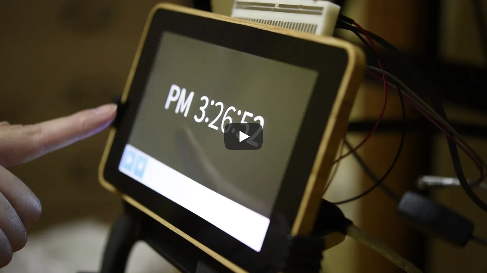

[onkyori_common]: https://github.com/jun10000/onkyori_common

# onkyori_kiosk
onkyori_*** are modules what enable cooperation with the Onkyo RI system.

## Description
[](https://www.youtube.com/watch?v=-5aI0-sRg24)

The onkyori_kiosk is the dashboard what shows the clock etc., and occurs something when Onkyo-RI signal has registered to database.  
This dashboard needs [onkyori_common] module to operate.

## Requirement
- Requirements of [onkyori_common]
- Raspberry Pi 3 Type B
    - Physical parts:
        - Raspberry Pi official 7" touchscreen display
        - 3.5mm audio cable
    - Linux packages:
        - Apache 2.4.25
        - Chromium 65.0.3325.181

## Usage
- Synchronising with Onkyo RI equipment  
    When Onkyo RI equipment powers on, Kiosk terminal also works on.  
    (Please view the video in the 'Description' section.)
- Manual operation  
    [](https://www.youtube.com/watch?v=LCoxE3PhgIc)
    When the kiosk screen is touched, the bottom control bar is shown/hidden.  
    The control bar includes music play button, and brightness switch button.  

## Install
1. Place files into Raspberry Pi
    1. Login to Raspberry Pi.
    1. Create directory: '/var/www/html/onkyori_kiosk/'.
    1. Place this repository files to '/var/www/html/onkyori_kiosk/'.
    1. Add execute permission to 'cmd.py'.
    1. Rewrite '.htaccess' to fit your environment.
    1. Create directory: '/var/www/html/onkyori_kiosk/music/'.
    1. Place your music file (Flac format) as '1.flac' into '/var/www/html/onkyori_kiosk/music/'.
1. Set Apache settings
    1. Rewrite '/etc/apache2/apache2.conf' to the following lines.
        ```apacheconfig
        <Directory /var/www/>
        Options +ExecCGI
        AllowOverride All
        Require all granted
        </Directory>
        ```
    1. Rewrite '/etc/apache2/mods-enabled/mime.conf' to the following lines.  
        ```apacheconfig
        #AddHandler cgi-script .cgi
        AddHandler cgi-script .cgi .py
        ```
1. Set autostart file
    1. Rewrite '~/.config/lxsession/LXDE-pi/autostart' to the following lines.  
        ```
        @lxpanel --profile LXDE-pi
        @pcmanfm --desktop --profile LXDE-pi
        #@xscreensaver -no-splash
        @point-rpi
        
        # Disable Screensaver
        @xset s off
        
        # Disable DPMS Features
        @xset -dpms
        
        # Change Brightness Permission
        @sudo chmod 666 /sys/class/backlight/rpi_backlight/brightness
        
        # Start Chromium in Kiosk Mode
        @chromium-browser --noerrdialogs --kiosk --incognito http://127.0.0.1/onkyori_kiosk/
        ```
    1. Reboot your Raspberry Pi.

## Licence
[GNU General Public License v3.0](https://github.com/jun10000/onkyori_kiosk/blob/master/LICENSE)

## Author
[jun10000](https://github.com/jun10000)
